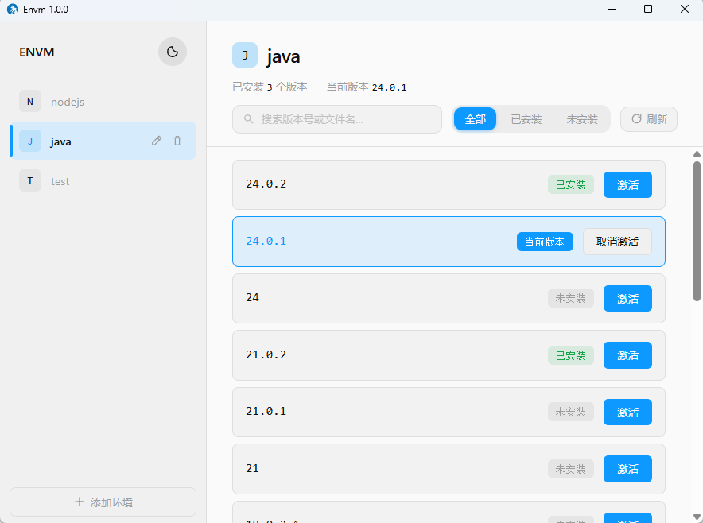
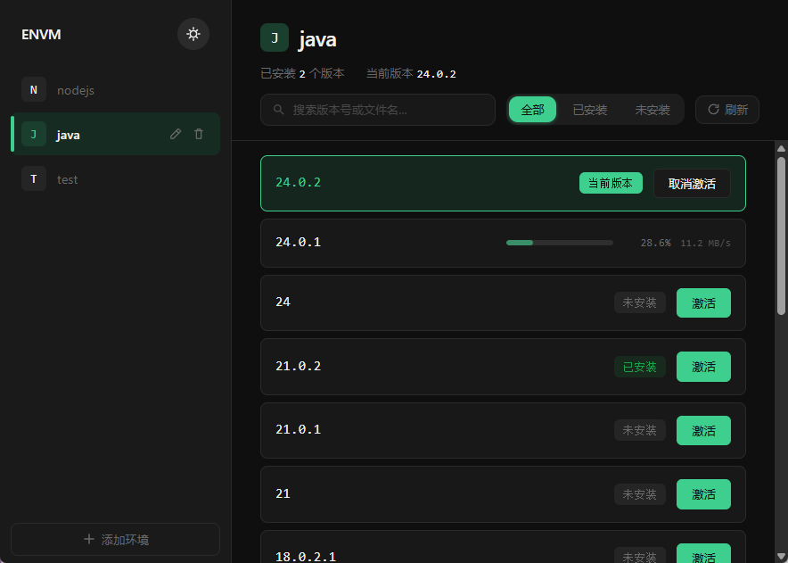

# ENVM — Environment Manager

> A desktop environment version manager built on Electron, supporting multi-runtime environment version browsing, downloading, switching, and automatic PATH management.

   

---

## Overview

**ENVM** lets you manage runtime versions for your local development environment just like managing package versions. It can:

- Manage multiple **environment groups** (e.g., Node.js, Java, Python, etc.)
- Automatically fetch **version lists** from mirror sources
- One-click **download & extract** target versions
- Switch the currently active version via **symbolic links**
- Automatically maintain system **PATH environment variables**
- Push download progress in real-time via **WebSocket**

## Screenshots


*Main interface: environment group sidebar on the left + version list panel on the right*


*Version management: download progress, version switching, and search filtering*

---

## Features

### 📦 Environment Group Management
- Create / Edit / Delete environment groups
- Each group supports custom **mirror repository URL** and **version fetching script**
- Built-in default configurations for Node.js, Java, and other common environments

### ⬇️ Version Management
- Automatically fetch available version lists from remote mirror sources
- Real-time download progress and speed display
- Automatic extraction after download (supports `.zip` / `.7z` formats)
- Version filtering (All / Installed / Uninstalled) and search

### 🔄 Version Switching
- Automatically creates a symbolic link to a unified directory when activating a version
- Automatically adds the `bin` directory to the user PATH
- Automatically deactivates the old version when switching

### 🛠️ Extensible Scripts
- Each environment group supports a custom **version list fetching script** (JavaScript / TypeScript)
- Scripts have access to `fetch`, `moment`, `radashi`, and other utilities
- Online script editing with Monaco Editor

### 🌓 Theme Switching
- Light / Dark theme toggle, follows system preference

---

## Tech Stack

### Backend (Electron Main Process)

| Technology | Purpose |
|------------|---------|
| **Electron** | Desktop application framework |
| **Hono** | Lightweight HTTP API framework |
| **better-sqlite3** | SQLite database |
| **drizzle-orm** | Type-safe ORM |
| **ws** | WebSocket server for real-time download progress |
| **7zip-bin / 7zip-min** | Archive extraction |
| **node-downloader-manager** | File download manager |

### Frontend (Electron Renderer Process)

| Technology | Purpose |
|------------|---------|
| **Vue 3** | UI framework |
| **Vue Router** | Frontend routing |
| **Alova** | Declarative HTTP request library |
| **Element Plus** | UI component library |
| **Monaco Editor** | Code editor (script editing) |
| **UnoCSS** | Instant atomic CSS engine |
| **Vite** | Build tool |
| **vue-i18n** | Internationalization (i18n) |

### Build & Package

- **electron-vite** — Electron + Vite integrated build
- **electron-builder** — Cross-platform packaging (Windows NSIS / macOS DMG)

---

## Quick Start

### Prerequisites

- Node.js >= 18
- Git

### Installation

```bash
# Clone the repository
git clone https://github.com/your-username/envm.git
cd envm

# Install main process dependencies
cd app
npm install

# Install UI dependencies
cd ../ui
npm install
```

### Running in Development Mode

```bash
# Start development mode in the app directory (starts both Electron + UI)
cd app
npm run dev
```

### Building for Production

```bash
# 1. Build the UI
cd ui
npm run build

# 2. Build the main process and package
cd ../app
npm run build:win       # Windows installer
# or
npm run build:dir       # Directory output only (for debugging)
```

---

## Project Structure

```
envm/
├── app/                          # Electron main process
│   ├── src/
│   │   ├── index.ts              # Application entry: window creation & HTTP/WS server startup
│   │   ├── entities/             # Data models (drizzle-orm schema)
│   │   │   ├── EnvGroup.ts       # Environment group table
│   │   │   ├── EnvItem.ts        # Environment version item table
│   │   │   ├── index.ts          # Database initialization & table creation
│   │   │   └── init.ts           # Default initialization data
│   │   ├── routes/               # Hono HTTP routes
│   │   │   ├── envGroupRoute.ts  # Group CRUD API
│   │   │   ├── envItemRoute.ts   # Version item API (status toggle, delete)
│   │   │   └── systemRoute.ts    # System API (quit)
│   │   ├── services/             # Business logic layer
│   │   │   ├── envGroupService.ts # Group service: CRUD + remote version fetching
│   │   │   ├── envItemService.ts  # Version service: download/extract/symlink/PATH management
│   │   │   └── wsService.ts       # WebSocket service (singleton, broadcasts download progress)
│   │   └── utils/
│   │       ├── comm.ts           # Utility functions: symlinks, extraction, PATH operations
│   │       └── 7z-min.ts         # 7zip extraction wrapper (compatible with asar packaging)
│   ├── build/
│   │   ├── build-ui.js           # UI build script
│   │   └── entitlements.mac.plist # macOS signing configuration
│   ├── electron-builder.ts       # electron-builder packaging configuration
│   └── package.json
│
├── ui/                           # Vue 3 frontend
│   ├── src/
│   │   ├── main.ts               # Entry point
│   │   ├── App.vue               # Root component (Element Plus i18n + theme)
│   │   ├── router.ts             # Route configuration
│   │   ├── style.css             # Global styles (CSS variables, light/dark themes)
│   │   ├── locales/              # i18n language packs
│   │   │   ├── index.ts          # i18n configuration
│   │   │   ├── zh-CN.ts          # Chinese language pack
│   │   │   └── en.ts             # English language pack
│   │   ├── apis/                 # API layer (based on Alova)
│   │   │   ├── EnvGroup.ts       # Environment group API
│   │   │   ├── EnvItem.ts        # Version item API
│   │   │   └── System.ts         # System API
│   │   ├── components/           # Components
│   │   │   ├── EnvSidebar.vue    # Sidebar: environment group list
│   │   │   ├── VersionList.vue   # Version list: display/filter/search versions
│   │   │   ├── VersionItem.vue   # Single version item: status/download progress/activate button
│   │   │   ├── TsEditorDialog.vue # Script editor dialog
│   │   │   └── MonacoEditor.vue  # Monaco Editor wrapper
│   │   ├── pages/config/         # Configuration pages
│   │   │   ├── index.vue         # Main page: sidebar + version list
│   │   │   ├── save.vue          # Add/Edit environment group dialog
│   │   │   └── scriptDefines.ts  # Script type definitions & default templates
│   │   └── comm/                 # Common modules
│   │       ├── alova.ts          # Alova instance configuration
│   │       ├── websocket.ts      # WebSocket client manager
│   │       ├── useTheme.ts       # Theme switching composable
│   │       ├── comm.ts           # General utility functions
│   │       └── clipboard.ts      # Clipboard utilities
│   ├── vite.config.ts            # Vite configuration
│   ├── uno.config.ts             # UnoCSS configuration
│   └── package.json
│
├── docs/
│   └── websocket-api.md          # WebSocket API documentation
│
├── Dockerfile                    # Docker build configuration
├── LICENSE                       # MIT License
└── README.md                     # Documentation (Chinese)
└── README.en.md                  # Documentation (English)
```

---

## License

This project is licensed under the MIT License. See the [LICENSE](LICENSE) file for details.
